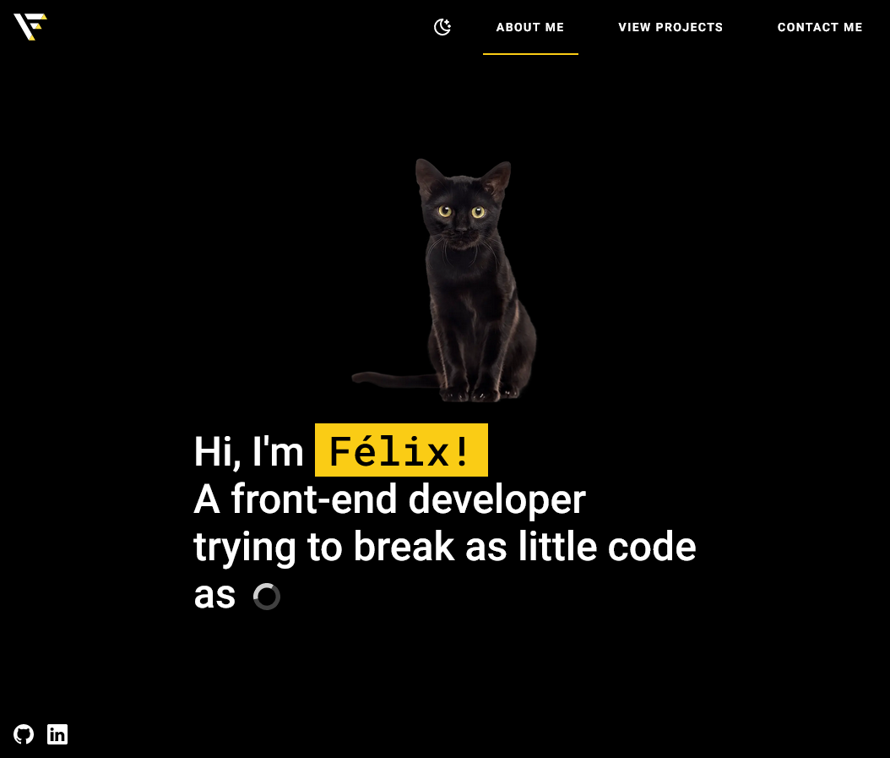
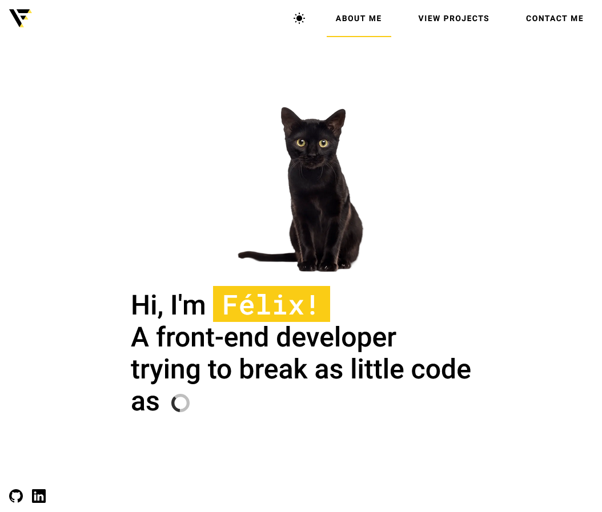
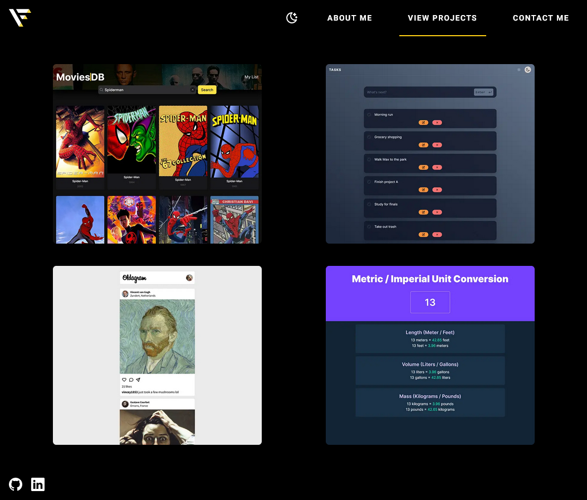
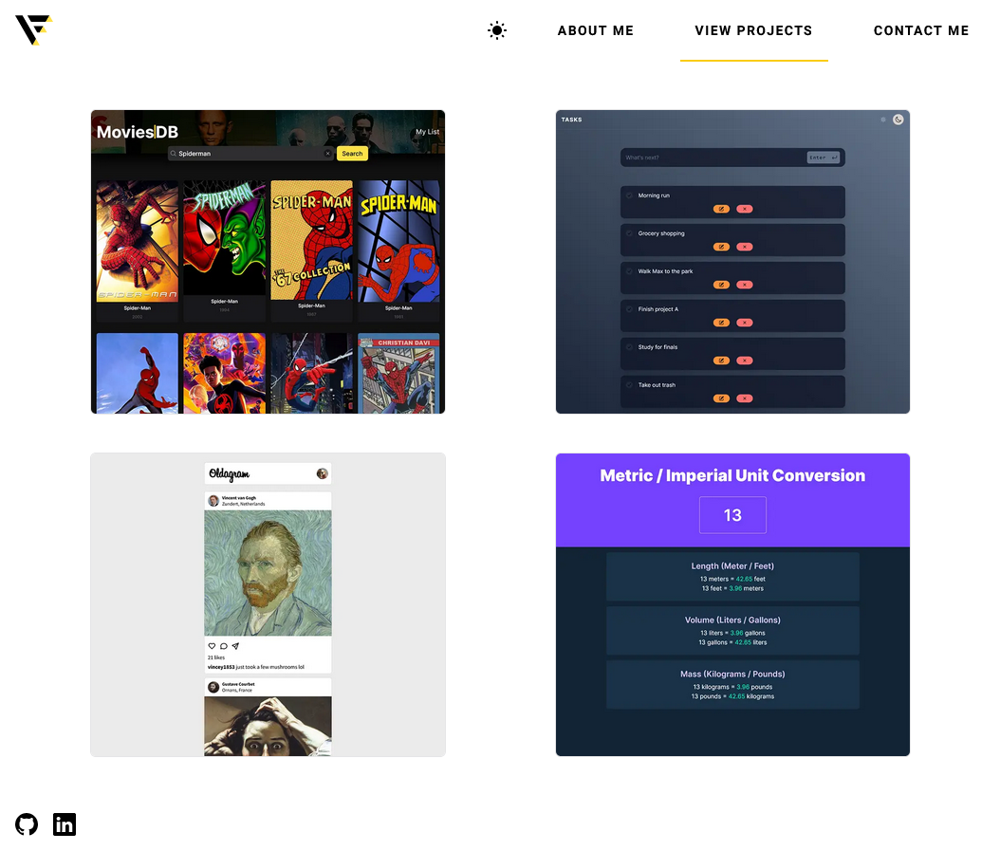
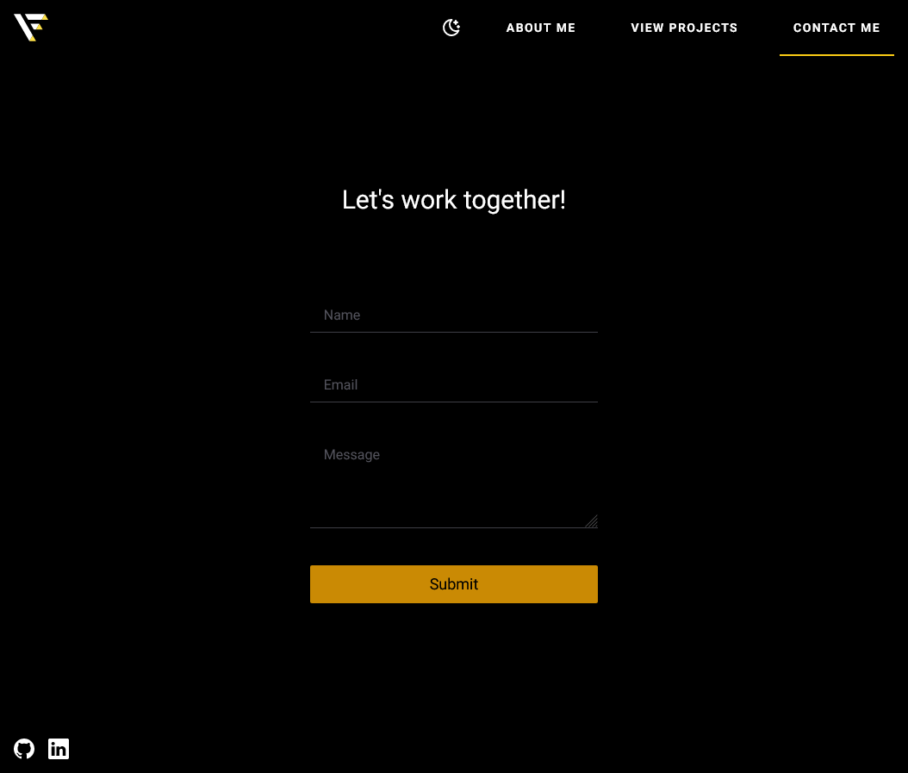
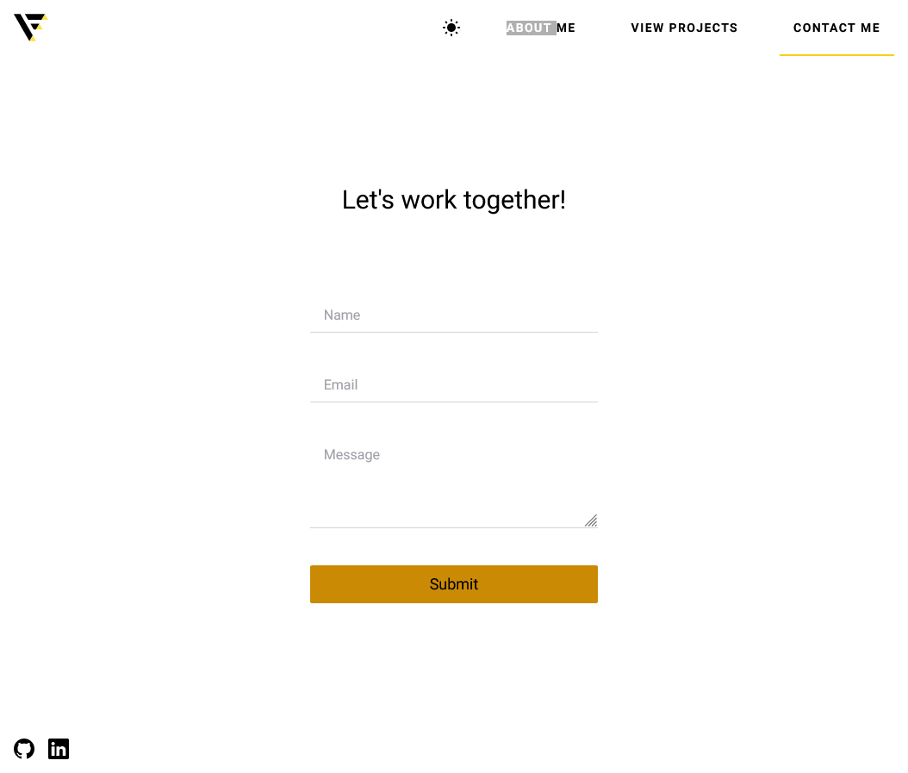

# Personal Website

My personal website built with next.js to showcase projects. Features a contact page where you can leave me a message with your name and email, then sends all of that information to my personal email with the help of nodemailer.

## Live demo

[Vercel](https://link.../)

## Screenshots

  
  
  
  
  
  

## Built with

- Next
- Tailwind
- Framer motion
- Nodemailer
- Usehooks-ts
